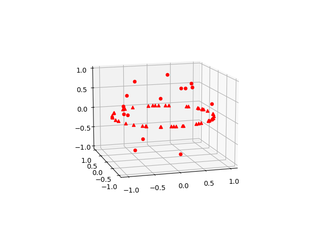

# (Simultaneous) Robust Subspace Recovery + Applications to TDA 

This project was done to supplement the final oral presentation portion of my comprehensive exams.

# Background:

### Robust Subspace Recovery - overview 
Given a point cloud $\mathcal{X} \in \mathbb{R}^D$, the Robust Subspace Recovery (RSR) problem aims to determine a lower dimensional linear subspace structure in $\mathcal{X}$. Intuitively, the RSR problem aims to find a lower dimensional linear subspace $L$ that contains "enough" points of $\mathcal{X}$ so that by restricting to $\mathcal{X}\cap L \subseteq \mathcal{X}$, we do not drastically alter the stastical and topological properties of $\mathcal{X}$. One can understand RSR as an optimization problem over the Grasmannian $\mathrm{Gr}(D, \ell)$ parameterizing linear subspaces of $\mathrm{R}^D$ of a given fixed dimension $\ell$. Since the Grassmannian is a non-convex set, this optimization problem is very much non-trivial. Much progress has been made towards this problem, including some very powerful schemes such as Principal Component Analysis (PCA), that are used prominently in the data industry today. A more thorough overview of the RSR literature can be found [here](https://arxiv.org/pdf/1803.01013) and [here](https://jmlr.csail.mit.edu/papers/volume20/17-324/17-324.pdf). 

### Simultaneous RSR:

[This key paper](https://arxiv.org/abs/2003.02962) outlines a quiver based approach for simultaneous RSR. We mean simultaneous in the following sense: Suppose we have point clouds $\mathcal{X}_1 \in \mathbb{R}^{d_1}, \dots, \mathcal{X}_m \in \mathbb{R}^{d_m}$ - which can now be concatenated into form a much higher dimensional point cloud $\mathcal{X} = [\mathcal{X}_1, \dots, \mathcal{X}_m] \in \mathbb{R}^D$ with $D = d_1+\dots+d_m$. The SRSR problem aims to find a sequence of linear subspaces $(L_1,\dots, L_m)$ such that each $L_i$ contains enough points of $\mathcal{X}_i$. More details about this quiver based approach can be found in the paper attached above.  

## Using (S)RSR to resolve phantom homologies:

### TDA overview:
Topological Data Analysis (TDA) is an up and coming discipline in data science, and one of its celebrated accomplishments is the utilization of simplicial homology theory to study the so called "persistence homologies" of a dataset $\mathcal{X}$ that encode information about the "shape" of the data in question. Homology in algebraic topolgy, very roughly, deals with quantifying the holey-ness of a topological space. A first example in this area is that of $n-$dimensional holes in the data. For instance, a data set sampled from a circle poses a prominent 1-dimensional "hole" in the middle of the data set (people in this discipline typically ascribe the dimension of the shape to the dimension of the hole). The surface of sphere has no zero dimensional or one dimensional "holes", but poses a prominent 2 dimensional "hole" in its void inside. [This book](https://www.cs.purdue.edu/homes/tamaldey/book/CTDAbook/CTDAbook.html) and [this book](https://www.amazon.com/Topological-Analysis-Applications-Gunnar-Carlsson/dp/1108838650) formally introduces the subject and all the required background from a data science perspective.

### Dealing with phantom homologies:
Understandably, when the data $\mathcal{X}$ is corrupted by higher dimensional noise (as is the case in the premise of the RSR problem), running TDA schemes on it could cause unwanted higher dimensional homologies to show up in our analysis, which could misinform our model. Therefore, one could create an RSR-TDA pipeline, where we refine our data $\mathcal{X}$ by recovering a lower dimensional subspace that eradicates these higher dimensional corrputions, and then running TDA analysis on the truncated data. In addition to allowing for dimenison reduction, this also refines the output of our TDA scheme that is now unbothered by higher dimensional noise, thereby resolving the phantom homologies that would have shown up otherwise.  

# The code: 

The `rsr_helper.py` contains an RSR class which when given the point cloud $\mathcal{X}$ (written as a sequence of np arrays, one for each $\mathcal{X}_i \in \mathbb{R}^{d_i}$) initializes the setup for algorithm P presented in the key paper, which returns a $\mathrm{corank}(B)$ shrunk subspace. The class function `RSR.generate_labels()` takes the shrunk subspace (along with the original data) to generate labels that distinguishes points contained in a lower dimensional subspaces $L_i$.

The `tda_helper.py` contains methods that perform homology computations on the data. This is done primarily by utilizing a tda library [Teaspoon](https://github.com/teaspoontda/teaspoon) developed and maintained by [Liz Munch](https://elizabethmunch.com/) from Michigan State University. The particular teaspoon functions we use for persistence homology computations utilizes the [RIPSER.py](https://ripser.scikit-tda.org/en/latest/) library which wraps around the "blazingly fast" C++ RIPSER package.

The `examples.py` contains custom methods that generate synthetic data for demo purposes.

The `demo.py` does the thing it says it is trying to do.

# Results:

### RSR demo
The first part of the demo illustrates the ability of the SRSR scheme in `rsr_helper.py` to perform RSR tasks. The data for this part of the demo consists of a plane union a line. Of course, the plane here is the prominent subspace $L$ we would like to recover, which we promptly do, as illustrated below:

  
   

### RSR + TDA demo
The second part of the demo illustrates the use of RSR in conjunction with persistence homology computations. Illustrated below is the original data set, which is data sampled from the unit circle in the x-y plane, with synthetic noise data sampled from the unit ball in $\mathbb{R}^3$. The data, along with the homologies of the raw data is illustrated below:

  
   

Then we run the data through the RSR machine to extract data points contained in a smaller dimensional subspace. Illustrated below is this classification, along with the persistence diagrams generated by the clean data

  
   

which illustrates a clean dimension 1 homology representing the unit circle, and improved estimates on dimension 2 homologies. 

### SRSR demo

For the last part of this demo, we consider the two families of data points considered simultaneously. The RSR scheme is able to recover the data points that are subspaces contained in the correct respective lower dimensional subspaces, as illustrated below:

  
   
  

# Usage and future work:

Download and run `demo.py` to reproduce the results listed above. Follow similar layout to conduct your own data explorations. 

Algorithm P from the key paper involves constructing huge matrices whose dimensions scale linearly with the number of data points. Further optimization to speed up algorithm P from the SRSR paper is required. The existing code already takes advantage of the sparsity of these matrices, but can certainly be improved upon.